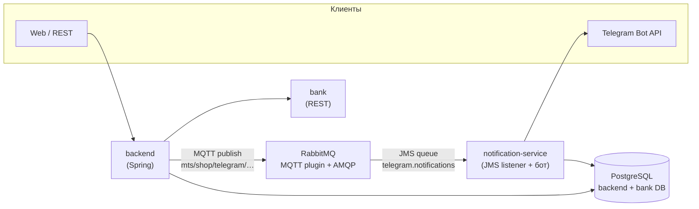

# MTS Online Shop — где выполнены требования ЛР №2

Краткая карта: **транзакции (Spring JTA + Narayana)**, **декларативные транзакции**, **Spring Security + JAAS**, **учётные записи в XML**, **JWT**, **роли и привилегии**, **OpenAPI**, **деплой на helios**.

---

## 1. Управление транзакциями: Spring JTA + Narayana

| Что сделано | Где в коде |
|-------------|------------|
| Менеджер транзакций JTA на Narayana | [`backend/src/main/java/com/mts/online_shop/config/NarayanaJtaConfig.java`](backend/src/main/java/com/mts/online_shop/config/NarayanaJtaConfig.java) — бин `transactionManager`: `JtaTransactionManager` + `com.arjuna.ats.jta.TransactionManager.transactionManager()` |
| Зависимости Narayana | [`backend/build.gradle.kts`](backend/build.gradle.kts) — `org.jboss.narayana.jta:narayana-jta`, `narayana-jta:jta` |
| Декларативные транзакции `@Transactional` | Например [`backend/src/main/java/com/mts/online_shop/service/OrderService.java`](backend/src/main/java/com/mts/online_shop/service/OrderService.java) (`createOrderWithPayment`, `cancelOrder`, `adminCancelOrder` и др.), [`AuthService`](backend/src/main/java/com/mts/online_shop/service/AuthService.java) |
| Логирование вокруг транзакций (аспект) | [`backend/src/main/java/com/mts/online_shop/aspect/NarayanaTransactionAspect.java`](backend/src/main/java/com/mts/online_shop/aspect/NarayanaTransactionAspect.java) — `@Around("@annotation(org.springframework.transaction.annotation.Transactional)")` |

Пример настройки JTA:

```15:20:backend/src/main/java/com/mts/online_shop/config/NarayanaJtaConfig.java
    @Bean(name = "transactionManager")
    public PlatformTransactionManager transactionManager() {
        JtaTransactionManager transactionManager = new JtaTransactionManager();
        transactionManager.setTransactionManager(com.arjuna.ats.jta.TransactionManager.transactionManager());
        transactionManager.setUserTransaction(com.arjuna.ats.jta.UserTransaction.userTransaction());
        return transactionManager;
```

---

## 2. Spring Security + JAAS, пользователи в XML

| Что сделано | Где в коде |
|-------------|------------|
| Конфигурация JAAS (`LoginContext` имя приложения) | [`backend/src/main/resources/jaas.conf`](backend/src/main/resources/jaas.conf) — приложение `MTSOnlineShop`, модуль `XmlUserLoginModule` |
| JAAS `LoginModule`: чтение пользователей из XML, проверка пароля | [`backend/src/main/java/com/mts/online_shop/security/jaas/XmlUserLoginModule.java`](backend/src/main/java/com/mts/online_shop/security/jaas/XmlUserLoginModule.java) |
| Файл учётных записей (логин, хеш пароля BCrypt, роли) | [`backend/src/main/resources/users.xml`](backend/src/main/resources/users.xml) |
| Подключение JAAS к Spring Security | [`backend/src/main/java/com/mts/online_shop/config/SecurityConfig.java`](backend/src/main/java/com/mts/online_shop/config/SecurityConfig.java) — `JaasAuthenticationProvider`, `setLoginContextName("MTSOnlineShop")`, `setLoginConfig(ClassPathResource("jaas.conf"))`, `AuthorityGranter` из `XmlUserPrincipal` |
| Цепочка HTTP-безопасности: публичные пути, роли для `/api/cart`, `/api/orders`, админка | Тот же [`SecurityConfig.java`](backend/src/main/java/com/mts/online_shop/config/SecurityConfig.java) — метод `filterChain` (`requestMatchers`, `hasRole` / `hasAnyRole`) |

Фрагмент `jaas.conf`:

```1:5:backend/src/main/resources/jaas.conf
MTSOnlineShop {
    com.mts.online_shop.security.jaas.XmlUserLoginModule required
        usersFile="classpath:users.xml"
        debug=true;
};
```

Фрагмент регистрации JAAS-провайдера:

```50:76:backend/src/main/java/com/mts/online_shop/config/SecurityConfig.java
        JaasAuthenticationProvider jaasProvider = new JaasAuthenticationProvider();
        jaasProvider.setLoginContextName("MTSOnlineShop");
        Resource jaasConfigResource = new ClassPathResource("jaas.conf");
        jaasProvider.setLoginConfig(jaasConfigResource);
        jaasProvider.setAuthorityGranters(new org.springframework.security.authentication.jaas.AuthorityGranter[] {
            principal -> {
                if (principal instanceof com.mts.online_shop.security.jaas.XmlUserPrincipal) {
                    com.mts.online_shop.security.jaas.XmlUserPrincipal xmlPrincipal =
                        (com.mts.online_shop.security.jaas.XmlUserPrincipal) principal;
                    return xmlPrincipal.getUser().getRoles();
                }
                return java.util.Collections.emptySet();
            }
        });
        // ...
        return new ProviderManager(jaasProvider);
```

---

## 3. JWT для доступа к REST

| Что сделано | Где в коде |
|-------------|------------|
| Выдача и разбор JWT | [`backend/src/main/java/com/mts/online_shop/security/JwtService.java`](backend/src/main/java/com/mts/online_shop/security/JwtService.java) |
| Фильтр: заголовок `Authorization: Bearer …` → установка `SecurityContext` | [`backend/src/main/java/com/mts/online_shop/security/JwtAuthenticationFilter.java`](backend/src/main/java/com/mts/online_shop/security/JwtAuthenticationFilter.java), регистрация в [`SecurityConfig`](backend/src/main/java/com/mts/online_shop/config/SecurityConfig.java) (`addFilterBefore(jwtAuthenticationFilter, …)`) |
| Настройки секрета / времени жизни | [`backend/src/main/resources/application.yaml`](backend/src/main/resources/application.yaml) — блок `jwt:` |

---

## 4. Роли и привилегии (спецификация + часть проверок)

| Что сделано | Где в коде |
|-------------|------------|
| XML-модель: роли → набор привилегий, список привилегий, привязка операций к привилегиям | [`backend/src/main/resources/security-model.xml`](backend/src/main/resources/security-model.xml) |
| Загрузка модели в память, проверка `hasPrivilege(Set<String> roles, String privilege)` | [`backend/src/main/java/com/mts/online_shop/security/PrivilegeService.java`](backend/src/main/java/com/mts/online_shop/security/PrivilegeService.java) |
| Аннотации `@RequirePrivilege`, `@RequireAnyPrivilege`, `@RequireAllPrivileges` + аспект | [`backend/src/main/java/com/mts/online_shop/security/annotation/`](backend/src/main/java/com/mts/online_shop/security/annotation/), [`PrivilegeCheckAspect.java`](backend/src/main/java/com/mts/online_shop/security/aspect/PrivilegeCheckAspect.java) |
| Разграничение по **ролям** на уровне контроллеров | `@PreAuthorize("hasRole('USER')")` — [`UserCartController.java`](backend/src/main/java/com/mts/online_shop/controller/UserCartController.java); `@PreAuthorize("hasRole('ADMIN')")` — [`AdminProductsController`](backend/src/main/java/com/mts/online_shop/controller/AdminProductsController.java), [`AdminUsersController`](backend/src/main/java/com/mts/online_shop/controller/AdminUsersController.java), [`AdminCartController`](backend/src/main/java/com/mts/online_shop/controller/AdminCartController.java) |

> **Замечание:** в `PrivilegeService.hasPrivilege(String username, String privilege)` сейчас заглушка `return true` — детальная проверка по привилегиям для имени пользователя не доведена до конца; основная защита REST идёт через **роли** в `SecurityConfig` и **`@PreAuthorize`**.

---

## 5. REST API и артефакты процесса

| Что сделано | Где |
|-------------|-----|
| Спецификация OpenAPI | [`api/openapi.yml`](api/openapi.yml) (версия указана в файле, сейчас 3.0.x) |
| Реализация эндпоинтов | [`backend/src/main/java/com/mts/online_shop/controller/`](backend/src/main/java/com/mts/online_shop/controller/) |
| Внешний банк (симулятор) | Модуль [`bank/`](bank/) |

---

## 6. Развёртывание на helios

| Что сделано | Где |
|-------------|-----|
| Сборка JAR и выкладка по SSH | [`.github/workflows/helios-deploy.yml`](.github/workflows/helios-deploy.yml) — `bootJar`, `scp` в `~/MTS/`, переменные `MTS_PORT`, `BANK_PORT`, `BANK_URL`, запуск `online-shop.jar` и `bank-simulator.jar` |

---

## Быстрая навигация по пакетам (backend)

- `com.mts.online_shop.config` — Security, JTA (Narayana), Swagger и др.
- `com.mts.online_shop.security` — JWT, фильтры, JAAS callback/principal, `XmlUserDetailsService`
- `com.mts.online_shop.security.jaas` — `XmlUserLoginModule` (JAAS)
- `com.mts.online_shop.service` — бизнес-логика и `@Transactional`
- `com.mts.online_shop.aspect` — обход `@Transactional` для логов Narayana

---

## Сборка и запуск (локально)

- **Backend:** из каталога `backend`: `./gradlew bootRun` (нужны JDK 21, PostgreSQL по `application.yaml`).
- **Bank:** из каталога `bank`: `./gradlew bootRun`.
- Порты и URL банка задаются переменными окружения / `application.yaml` (см. также шаг деплоя в `helios-deploy.yml`).

---

## Архитектура (Docker / сообщения / Telegram)



**Зачем два «коннекта» к уведомлениям.** Backend шлёт события в **один** брокер RabbitMQ по **MQTT** (топик с точками в routing key); в Rabbit настроена очередь `telegram.notifications` и привязка к `amq.topic`, а **notification-service** читает ту же очередь по **AMQP/JMS**. То есть это не два разных брокера, а один канал брокера с двумя протоколами на входе (MQTT из backend) и на выходе (JMS в сервисе уведомлений).

**Два контейнера `notification-service` в compose.** По умолчанию поднимается один экземпляр. Второй включён только с профилем `notify-scale` (`docker compose --profile notify-scale up`), потому что у **long polling** один и тот же `TELEGRAM_BOT_TOKEN` нельзя безопасно использовать в двух процессах одновременно — обновления `/start` и сообщений начнут «теряться» или конфликтовать.
