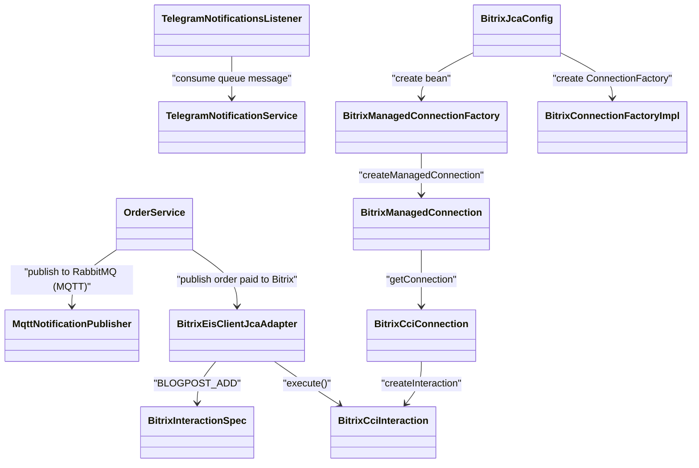
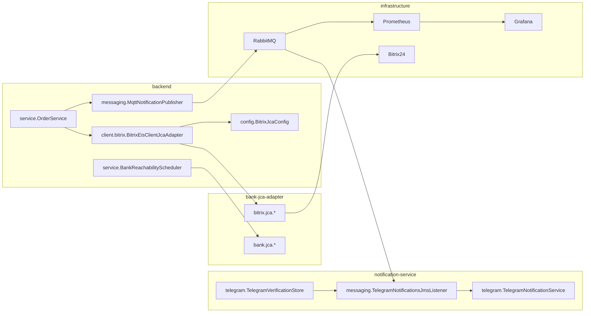

# Отчёт по ЛР3: асинхронность, распределённая обработка, Scheduler, JCA (Bitrix)

## 1) Проверка, что всё поднялось

На сервере запущены сервисы:
- `mts-backend` (`:8080`)
- `mts-bank` (`:8081`)
- `mts-rabbitmq` (`:5672`, `:1883`, `:15672`, `:15692`)
- `mts-notify-1` (`:18081`)
- `mts-notify-2` (`:18082`, поднят через профиль `notify-scale`)
- `mts-prometheus` (`:9090`)
- `mts-grafana` (`:3000`)
- `mts-postgres` (`:5432`)

Проверки доступности:
- Prometheus ready: `http://149.33.16.227:9090/-/ready`
- Grafana health: `http://149.33.16.227:3000/api/health`
- RabbitMQ management API: `http://149.33.16.227:15672/api/overview`
- Backend API и Swagger: `http://149.33.16.227:8080/api/swagger-ui/index.html`

Проверка выполнялась командами:
- `docker compose -f docker/docker-compose.yml ps`
- `curl` к health/overview endpoint'ам

---

## 2) Что сделано по требованиям ЛР3

## 2.1 Асинхронная обработка (RabbitMQ + очередь + MQTT + получение)

### Что отправляется и откуда
- Backend отправляет события в RabbitMQ по MQTT в `topic` `mts/shop/telegram/notify`.
- Формат события: `TelegramNotificationEnvelope` из [`messaging-contracts/src/main/java/com/mts/messaging/contracts/TelegramNotificationEnvelope.java`](messaging-contracts/src/main/java/com/mts/messaging/contracts/TelegramNotificationEnvelope.java).
- Типы сообщений:
  - `VERIFICATION` (привязка Telegram)
  - `PLAIN_TEXT` (уведомление об оплате заказа)

Где реализовано:
- MQTT publisher: [`backend/src/main/java/com/mts/online_shop/messaging/MqttNotificationPublisher.java`](backend/src/main/java/com/mts/online_shop/messaging/MqttNotificationPublisher.java)
- Публикация при привязке Telegram: [`backend/src/main/java/com/mts/online_shop/service/TelegramLinkService.java`](backend/src/main/java/com/mts/online_shop/service/TelegramLinkService.java)
- Публикация после оплаты: [`backend/src/main/java/com/mts/online_shop/service/OrderService.java`](backend/src/main/java/com/mts/online_shop/service/OrderService.java)

### RabbitMQ как провайдер и очередь сообщений
- Провайдер: RabbitMQ в Docker.
- Очередь: `telegram.notifications`.
- Bind к `amq.topic` с ключом `mts.shop.telegram.#`.

Где реализовано:
- RabbitMQ контейнер и setup: [`docker/docker-compose.yml`](docker/docker-compose.yml)
- Инициализация queue/binding: сервис `rabbitmq-setup` в том же compose.
- MQTT plugin включён в [`docker/rabbitmq/Dockerfile`](docker/rabbitmq/Dockerfile).

### Получение сообщений
- Получение реализовано consumer-узлом `notification-service` через `@RabbitListener`.
- Основной consumer: [`notification-service/src/main/kotlin/com/wish_notification/notification_service/messaging/TelegramNotificationsJmsListener.kt`](notification-service/src/main/kotlin/com/wish_notification/notification_service/messaging/TelegramNotificationsJmsListener.kt).

Примечание:
- Класс называется `...JmsListener`, но фактически используется Spring AMQP (`@RabbitListener`) и `@EnableRabbit` в [`notification-service/src/main/kotlin/com/wish_notification/notification_service/config/JmsConfig.kt`](notification-service/src/main/kotlin/com/wish_notification/notification_service/config/JmsConfig.kt).

---

## 2.2 Распределённая обработка

- Реализованы два независимых узла обработки:
  - `notification-service-1`
  - `notification-service-2` (через профиль `notify-scale`)

Где:
- Конфигурация двух узлов: [`docker/docker-compose.yml`](docker/docker-compose.yml)
- Запуск второго узла: `docker compose --profile notify-scale up -d notification-service-2`

Транзакционность:
- На backend используется Spring Transaction + Narayana JTA (ранее реализовано в ЛР2/ЛР3 коде backend).
- Операции в `OrderService` помечены `@Transactional`.
- Для интеграции с Bitrix выбран режим best-effort (ошибка Bitrix не ломает успешную оплату), чтобы не нарушать пользовательский сценарий.

---

## 2.3 Периодические задачи (@Scheduled)

Сценарии scheduler:
- Проверка доступности банка:
  - [`backend/src/main/java/com/mts/online_shop/service/BankReachabilityScheduler.java`](backend/src/main/java/com/mts/online_shop/service/BankReachabilityScheduler.java)
  - `@Scheduled(fixedRateString = "${app.bank.health-check-ms:300000}")`
- Очистка просроченных кодов верификации Telegram:
  - [`notification-service/src/main/kotlin/com/wish_notification/notification_service/telegram/TelegramVerificationStore.kt`](notification-service/src/main/kotlin/com/wish_notification/notification_service/telegram/TelegramVerificationStore.kt)
  - `@Scheduled(fixedRate = 3600000)`

---

## 2.4 Интеграция с EIS через JCA (Bitrix)

Выбранный простой use-case:
- После успешной оплаты заказа backend отправляет в Bitrix пост `log.blogpost.add`.
- Поля:
  - `POST_TITLE`: `Оплата заказа #<orderId>`
  - `POST_MESSAGE`: `orderId`, `userId`, `amount`, `timestamp`

Webhook:
- `BITRIX_WEBHOOK_BASE` (в `.env`) + endpoint `/log.blogpost.add.json`.

### Где встраивается в бизнес-процесс
- После подтверждения оплаты в [`backend/src/main/java/com/mts/online_shop/service/OrderService.java`](backend/src/main/java/com/mts/online_shop/service/OrderService.java) вызывается `BitrixEisClientJcaAdapter.publishOrderPaid(...)`.

### Как реализована JCA-цепочка

На backend:
- Свойства Bitrix:
  - [`backend/src/main/java/com/mts/online_shop/client/bitrix/BitrixEisProperties.java`](backend/src/main/java/com/mts/online_shop/client/bitrix/BitrixEisProperties.java)
- Конфиг JCA-фабрики:
  - [`backend/src/main/java/com/mts/online_shop/config/BitrixJcaConfig.java`](backend/src/main/java/com/mts/online_shop/config/BitrixJcaConfig.java)
- Клиент-адаптер:
  - [`backend/src/main/java/com/mts/online_shop/client/bitrix/BitrixEisClientJcaAdapter.java`](backend/src/main/java/com/mts/online_shop/client/bitrix/BitrixEisClientJcaAdapter.java)

В `bank-jca-adapter` (новый пакет `com.mts.online_shop.bitrix.jca`):
- [`bank-jca-adapter/src/main/java/com/mts/online_shop/bitrix/jca/BitrixManagedConnectionFactory.java`](bank-jca-adapter/src/main/java/com/mts/online_shop/bitrix/jca/BitrixManagedConnectionFactory.java)
- [`bank-jca-adapter/src/main/java/com/mts/online_shop/bitrix/jca/BitrixConnectionFactoryImpl.java`](bank-jca-adapter/src/main/java/com/mts/online_shop/bitrix/jca/BitrixConnectionFactoryImpl.java)
- [`bank-jca-adapter/src/main/java/com/mts/online_shop/bitrix/jca/BitrixManagedConnection.java`](bank-jca-adapter/src/main/java/com/mts/online_shop/bitrix/jca/BitrixManagedConnection.java)
- [`bank-jca-adapter/src/main/java/com/mts/online_shop/bitrix/jca/BitrixCciConnection.java`](bank-jca-adapter/src/main/java/com/mts/online_shop/bitrix/jca/BitrixCciConnection.java)
- [`bank-jca-adapter/src/main/java/com/mts/online_shop/bitrix/jca/BitrixCciInteraction.java`](bank-jca-adapter/src/main/java/com/mts/online_shop/bitrix/jca/BitrixCciInteraction.java)
- [`bank-jca-adapter/src/main/java/com/mts/online_shop/bitrix/jca/BitrixInteractionSpec.java`](bank-jca-adapter/src/main/java/com/mts/online_shop/bitrix/jca/BitrixInteractionSpec.java)

### Для чего каждый класс Bitrix JCA

- `BitrixEisProperties`:
  - хранит настройки интеграции (`enabled`, `webhookBase`) из `application.yaml/.env`.
- `BitrixJcaConfig`:
  - создаёт `BitrixManagedConnectionFactory` и `bitrixJcaConnectionFactory`.
  - включается только при `app.bitrix.enabled=true`.
- `BitrixEisClientJcaAdapter`:
  - бизнес-адаптер backend.
  - формирует сообщение об оплате и вызывает JCA `Interaction`.
  - работает в режиме best-effort (ошибка Bitrix логируется, но оплата не откатывается).
- `BitrixInteractionSpec`:
  - объявляет тип операции (`BLOGPOST_ADD`) для JCA interaction.
- `BitrixManagedConnectionFactory`:
  - фабрика managed connection (JCA SPI), хранит base webhook URL.
- `BitrixConnectionFactoryImpl`:
  - CCI `ConnectionFactory`, выдаёт logical connections и `RecordFactory`.
- `BitrixManagedConnection`:
  - управляет lifecycle физического подключения и HTTP-клиентом.
- `BitrixCciConnection`:
  - logical CCI connection, создаёт `BitrixCciInteraction`.
- `BitrixCciInteraction`:
  - выполняет реальный outbound вызов Bitrix:
    - собирает `application/x-www-form-urlencoded`,
    - POST в `.../log.blogpost.add.json`,
    - парсит ответ и заполняет output record.

---

## 3) Мониторинг RabbitMQ через Grafana

Добавлено:
- RabbitMQ Prometheus exporter (`rabbitmq_prometheus`) в [`docker/rabbitmq/Dockerfile`](docker/rabbitmq/Dockerfile)
- Prometheus сервис + конфиг:
  - [`docker/prometheus/prometheus.yml`](docker/prometheus/prometheus.yml)
- Grafana сервис + provisioning:
  - [`docker/grafana/provisioning/datasources/datasource.yml`](docker/grafana/provisioning/datasources/datasource.yml)
  - [`docker/grafana/provisioning/dashboards/dashboards.yml`](docker/grafana/provisioning/dashboards/dashboards.yml)
  - [`docker/grafana/dashboards/rabbitmq-telegram-queue.json`](docker/grafana/dashboards/rabbitmq-telegram-queue.json)

Показатели на дашборде:
- входящий поток в RabbitMQ (`incoming_to_rabbit/s`);
- delivery/ack в consumer (`delivered_to_consumer/s`, `acked/s`);
- backlog очереди `telegram.notifications` (`ready`, `unacked`).

---

## 4) Как и где выполнены условия лабы (чек-лист)

### Требования к асинхронной обработке

- Прецеденты асинхронности: выполнено.
  - Верификация Telegram, уведомление об оплате.
  - Реализовано в `TelegramLinkService`, `OrderService`, `notification-service`.
- Модель доставки queue: выполнено.
  - Очередь `telegram.notifications`.
- Провайдер RabbitMQ: выполнено.
  - Compose + RabbitMQ сервис.
- Отправка MQTT: выполнено.
  - `MqttNotificationPublisher` (Eclipse Paho MQTT).
- Получение сообщений: выполнено через listener-обработчик в `notification-service`.
  - Текущая реализация использует Spring AMQP `@RabbitListener`.

### Требования к распределённой обработке

- Два независимых узла: выполнено.
  - `notification-service-1` и `notification-service-2`.
- Транзакционность: выполнено на backend уровне Spring Transaction/JTA.
  - Для Bitrix EIS интеграции выбран best-effort (без срыва оплаты при ошибке внешней системы).

### Требования к периодическим задачам

- `@Scheduled` прецеденты: выполнено.
  - Ping банка.
  - Cleanup просроченных verification-кодов.

### Требования к EIS через JCA

- EIS согласована и подключена: выполнено (Bitrix).
- Взаимодействие через JCA: выполнено.
  - Полный набор JCA классов реализован в `bank-jca-adapter` + backend config/client.

### Правила выполнения работы

- Изменения отражены в архитектуре/конфигурации и REST-интеграции: выполнено.
  - Асинхронный контур, мониторинг, JCA EIS.
- Демонстрация на собственной инфраструктуре: выполнено.
  - Развёрнуто на сервере `149.33.16.227` через Docker Compose и `start.sh`.

---

## 5) Что именно отправляется в Bitrix

После успешной оплаты создаётся пост в Bitrix:
- endpoint: `<BITRIX_WEBHOOK_BASE>/log.blogpost.add.json`
- body (`application/x-www-form-urlencoded`):
  - `POST_TITLE=Оплата заказа #<orderId>`
  - `POST_MESSAGE=Заказ успешно оплачен...`

Факт отправки подтверждается в логах backend строкой:
- `BitrixEisClientJcaAdapter : Bitrix blogpost add success: <id>`

---

## 6) Запуск и проверка

Базовый запуск:
- `./start.sh`

Запуск второго узла обработки:
- `docker compose -f docker/docker-compose.yml --profile notify-scale up -d notification-service-2`

Проверка сервисов:
- `docker compose -f docker/docker-compose.yml ps`

Полезные URL:
- Grafana: `http://149.33.16.227:3000`
- Prometheus: `http://149.33.16.227:9090`
- RabbitMQ UI: `http://149.33.16.227:15672`
- Backend API: `http://149.33.16.227:8080/api`

---

## 7) Mermaid: диаграмма классов (обобщённо)

## 8) Mermaid: диаграмма пакетов (обобщённо)

