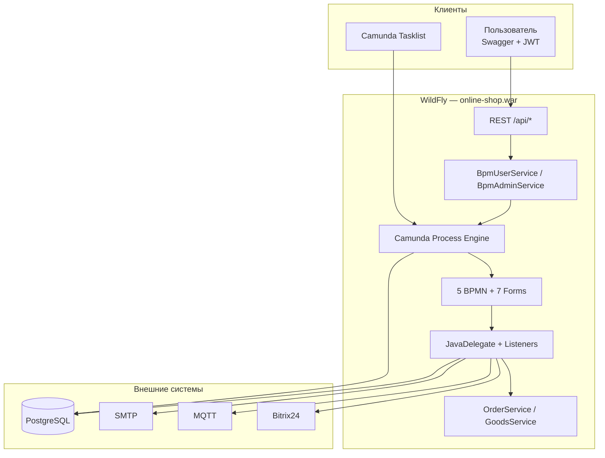
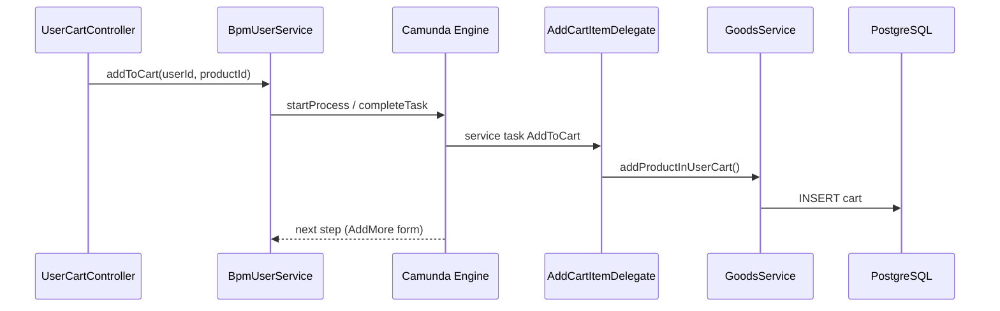

# ЛР4: Camunda BPM (embedded) + WildFly

Отчёт о выполнении лабораторной работы: интеграция BPMS Camunda 7 в MTS Online Shop, замена статической бизнес-логики на динамическую на базе BPMN 2.0, деплой на Helios/WildFly.

## Содержание

1. [Цель и общий подход](#1-цель-и-общий-подход)
2. [Простыми словами](#простыми-словами)
3. [BPM-движок Camunda (embedded)](#2-bpm-движок-camunda-embedded-mode)
4. [BPMN-процессы](#3-описание-бизнес-процессов-bpmn-20-camunda-modeler)
5. [Статика → динамика](#4-замена-статической-логики-на-динамическую)
6. [JavaDelegate](#5-javadelegate--бизнес-шаги-внутри-процесса)
7. [Listeners](#6-taskexecution-listeners)
8. [Forms](#7-camunda-forms-генератор-форм)
9. [Требования прошлых ЛР](#8-сохранение-требований-из-предыдущих-лр)
10. [Внешние системы](#9-интеграция-подсистем-через-apiадаптеры)
11. [Деплой Helios](#11-деплой-на-helios--wildfly)
12. [Подробно: что / как / где (по блокам)](#15-подробно-что-сделали-как-и-в-каких-файлах)
13. [Пример цепочки: корзина](#16-пример-цепочки-добавить-товар-в-корзину)
14. [Статика → динамика (слайд 6)](#17-статика--динамика-подробно-для-слайда-6)
15. [Защита лабораторной](#18-защита-лабораторной)
16. [Шпаргалка процесс → файлы](#19-шпаргалка-процесс--файлы)
17. [Слайды-план защиты](#20-слайды-план-защиты-7–9-слайдов)
18. [Выводы](#13-выводы)

---

## 1. Цель и общий подход

Ранее основная бизнес-логика (оформление заказа, отмена, CRUD товаров, оплата, уведомления) выполнялась **императивно** в Spring-сервисах и контроллерах. В ЛР4 эта логика перенесена в **BPMN 2.0-процессы** Camunda 7, а Java-код оставлен там, где нужны вызовы БД, внешних API и инфраструктуры (делегаты, listeners).

- **Оркестрация** — Camunda Process Engine (embedded mode).
- **Исполнение шагов** — `JavaDelegate` и `TaskListener`.
- **Пользовательский ввод** — Camunda Forms в Tasklist.

---

## Простыми словами

**Было:** программа сама знала все шаги заказа — всё было написано в Java (`OrderController` → `OrderService` → база).

**Стало:** шаги нарисованы **схемой** (файлы `.bpmn`), а Camunda **ведёт** процесс по этой схеме. Java только выполняет отдельные действия (запись в БД, email, telegram).

### Из чего состоит решение

| Часть | Где лежит | Зачем |
|-------|-----------|-------|
| **Схемы процессов** | `backend/src/main/resources/processes/*.bpmn` | Что делать и в каком порядке |
| **Формы** | `backend/src/main/resources/forms/*.form` | Что спросить у человека |
| **Делегаты** | `camunda/delegate/*.java` | Автоматические шаги → БД, почта |
| **Мост API** | `BpmUserService.java`, `BpmAdminService.java` | Swagger запускает/двигает процесс |
| **Tasklist** | `/camunda/app/tasklist/` | Человек заполняет формы в браузере |

### Аналогия

- **BPMN** — инструкция на стене («сначала корзина, потом оплата»).
- **Delegate** — работник на одном участке («записать в корзину»).
- **BpmUserService** — диспетчер: «начни процесс заказа» / «закрой задачу с такими данными».
- **OrderService** — склад/база данных (остался из прошлых лаб).

---

## 2. BPM-движок Camunda (embedded mode)

### 2.1. Подключение зависимостей

| Файл | Что сделано |
|------|-------------|
| [`backend/build.gradle.kts`](backend/build.gradle.kts) | `camunda-bpm-spring-boot-starter:7.22.0` — embedded Process Engine; `camunda-bpm-spring-boot-starter-webapp` — Tasklist/Cockpit/Admin (`/camunda/*`); `camunda-engine-rest-core-jakarta` — REST API (`/engine-rest/*`); packaging `war` для WildFly |

### 2.2. Конфигурация движка

| Файл | Что сделано |
|------|-------------|
| [`backend/src/main/resources/application.yaml`](backend/src/main/resources/application.yaml) | Секция `camunda.bpm`: `auto-deployment-enabled`, `deployment-resource-pattern` (`processes/**/*.bpmn`, `forms/**/*.form`), `job-execution.enabled` (async), `authorization.enabled`, `history-level: full` |

### 2.3. Embedded в WAR на WildFly

| Файл | Что сделано |
|------|-------------|
| [`backend/src/main/java/com/mts/online_shop/OnlineShopApplication.java`](backend/src/main/java/com/mts/online_shop/OnlineShopApplication.java) | `SpringBootServletInitializer` — запуск в WildFly; `@EnableScheduling` — периодические задачи Spring |
| [`backend/src/main/webapp/WEB-INF/jboss-web.xml`](backend/src/main/webapp/WEB-INF/jboss-web.xml) | Context root `/` |
| [`backend/src/main/webapp/WEB-INF/jboss-deployment-structure.xml`](backend/src/main/webapp/WEB-INF/jboss-deployment-structure.xml) | Отключены Weld/JAX-RS/JSF WildFly — нет конфликта со Spring + Camunda |
| [`backend/src/main/webapp/WEB-INF/web.xml`](backend/src/main/webapp/WEB-INF/web.xml) | Servlet-контейнер WAR |
| [`backend/src/main/webapp/WEB-INF/beans.xml`](backend/src/main/webapp/WEB-INF/beans.xml) | CDI bean discovery |

### 2.4. Конфигурация Camunda на WildFly

| Файл | Что сделано |
|------|-------------|
| [`backend/src/main/java/com/mts/online_shop/config/CamundaRestWarConfiguration.java`](backend/src/main/java/com/mts/online_shop/config/CamundaRestWarConfiguration.java) | Сервлет Camunda REST на `/engine-rest/*` |
| [`backend/src/main/java/com/mts/online_shop/config/CamundaResourceConfiguration.java`](backend/src/main/java/com/mts/online_shop/config/CamundaResourceConfiguration.java) | Статика webapp (`/camunda/app/**`, `/camunda/lib/**`) |
| [`backend/src/main/java/com/mts/online_shop/config/CamundaWebappRedirectFilter.java`](backend/src/main/java/com/mts/online_shop/config/CamundaWebappRedirectFilter.java) | Редирект `/camunda` → Tasklist |
| [`backend/src/main/java/com/mts/online_shop/config/CamundaJerseyConfiguration.java`](backend/src/main/java/com/mts/online_shop/config/CamundaJerseyConfiguration.java) | Application path `/engine-rest` |
| [`backend/src/main/java/com/mts/online_shop/config/CamundaLoginUnlockFilterConfig.java`](backend/src/main/java/com/mts/online_shop/config/CamundaLoginUnlockFilterConfig.java) | Регистрация фильтров входа в Camunda |
| [`backend/src/main/java/com/mts/online_shop/config/CamundaConfig.java`](backend/src/main/java/com/mts/online_shop/config/CamundaConfig.java) | Доп. beans Camunda |
| [`backend/src/main/java/com/mts/online_shop/config/SpringBootProcessEngineProvider.java`](backend/src/main/java/com/mts/online_shop/config/SpringBootProcessEngineProvider.java) | Связь REST API с Spring Process Engine |
| [`backend/src/main/resources/META-INF/services/org.camunda.bpm.engine.rest.spi.ProcessEngineProvider`](backend/src/main/resources/META-INF/services/org.camunda.bpm.engine.rest.spi.ProcessEngineProvider) | SPI для REST provider |

---

## 3. Описание бизнес-процессов (BPMN 2.0, Camunda Modeler)

Процессы лежат в [`backend/src/main/resources/processes/`](backend/src/main/resources/processes/), редактируются в **Camunda Modeler 4.12**, деплоятся автоматически при старте WAR.

### 3.1. Обзорная диаграмма (для отчёта)

| Файл | Назначение |
|------|------------|
| [`bpmn/lr4.bpmn`](bpmn/lr4.bpmn) | Единая **документационная** BPMN (не executable): все 5 процессов, дорожки USER/ADMIN/SERVICE, пул BANK |
| [`scripts/build-lr4-overview.mjs`](scripts/build-lr4-overview.mjs) | Скрипт пересборки обзорной диаграммы |

```bash
node scripts/build-lr4-overview.mjs
```

### 3.2. Пять исполняемых процессов

| Файл | process id | Кто запускает | Суть |
|------|------------|---------------|------|
| [`backend/src/main/resources/processes/user-lk-order.bpmn`](backend/src/main/resources/processes/user-lk-order.bpmn) | `user-lk-order` | `POST /api/cart/items`, `POST /api/orders/create` | Заказ в ЛК: корзина → резерв → оплата → subprocess |
| [`backend/src/main/resources/processes/user-order-cancel.bpmn`](backend/src/main/resources/processes/user-order-cancel.bpmn) | `user-order-cancel` | `POST /api/orders/{id}/cancel` | Отмена: user → проверка → admin → снятие резерва |
| [`backend/src/main/resources/processes/admin-product-create.bpmn`](backend/src/main/resources/processes/admin-product-create.bpmn) | `admin-product-create` | `POST /api/admin/products` | Создание товара (admin form → service task) |
| [`backend/src/main/resources/processes/admin-product-update.bpmn`](backend/src/main/resources/processes/admin-product-update.bpmn) | `admin-product-update` | `PUT /api/admin/products/{id}` | Изменение товара |
| [`backend/src/main/resources/processes/server-order-processing.bpmn`](backend/src/main/resources/processes/server-order-processing.bpmn) | `server-order-processing` | delegate из `user-lk-order` | Серверная обработка: склад, email, Telegram, Bitrix |

В каждом BPMN:

- `<bpmn:collaboration>` + `<bpmn:participant>` — pool «MTS Online Shop»
- `<bpmn:laneSet>` — дорожки **USER / ADMIN / SERVICE** по роли исполнителя
- `camunda:delegateExpression="${...Delegate}"` — service task → Spring bean
- `camunda:formRef="..."` + `camunda:formRefBinding="deployment"` — Camunda Forms
- `camunda:candidateGroups="user"` / `"admin"` — роли на user task
- `camunda:asyncBefore="true"` на `Task_MarkPaid` в [`user-lk-order.bpmn`](backend/src/main/resources/processes/user-lk-order.bpmn) — асинхронный шаг через Job Executor

### 3.3. Триггеры API

| Endpoint | Процесс | Контроллер |
|----------|---------|------------|
| `POST /api/cart/items` | `user-lk-order` | [`UserCartController.java`](backend/src/main/java/com/mts/online_shop/controller/UserCartController.java) |
| `POST /api/orders/create` | `user-lk-order` | [`OrderController.java`](backend/src/main/java/com/mts/online_shop/controller/OrderController.java) |
| `POST /api/orders/{id}/cancel` | `user-order-cancel` | [`OrderController.java`](backend/src/main/java/com/mts/online_shop/controller/OrderController.java) |
| `POST /api/admin/products` | `admin-product-create` | [`AdminProductsController.java`](backend/src/main/java/com/mts/online_shop/controller/AdminProductsController.java) |
| `PUT /api/admin/products/{id}` | `admin-product-update` | [`AdminProductsController.java`](backend/src/main/java/com/mts/online_shop/controller/AdminProductsController.java) |
| `POST /api/internal/bank/payment-callback` | correlate оплаты (опционально) | [`InternalBankController.java`](backend/src/main/java/com/mts/online_shop/controller/InternalBankController.java) |
| `GET/POST /api/camunda/tasks` | работа с задачами через JWT | [`CamundaTaskController.java`](backend/src/main/java/com/mts/online_shop/controller/CamundaTaskController.java) |

Вне BPMN: login/register ([`AuthController.java`](backend/src/main/java/com/mts/online_shop/controller/AuthController.java)), GET каталога, DELETE товаров/пользователей.

---

## 4. Замена «статической» логики на «динамическую»

### 4.1. Что было заменено

| Было (статика) | Стало (BPMS) |
|----------------|--------------|
| Прямые вызовы createOrder/оплаты/отмены из контроллеров | [`BpmUserService.java`](backend/src/main/java/com/mts/online_shop/camunda/BpmUserService.java) / [`BpmAdminService.java`](backend/src/main/java/com/mts/online_shop/camunda/BpmAdminService.java) → `RuntimeService.startProcessInstanceByKey()` |
| `TransactionalOrderService`, `DistributedTransactionService` (удалены) | Шаги BPMN + [`BpmDelegateSupport.java`](backend/src/main/java/com/mts/online_shop/camunda/BpmDelegateSupport.java) (`REQUIRES_NEW`) |
| Императивные сценарии в одном методе | Цепочки BPMN + gateway + boundary events |

### 4.2. Мост REST ↔ Camunda

| Файл | Методы / назначение |
|------|---------------------|
| [`BpmUserService.java`](backend/src/main/java/com/mts/online_shop/camunda/BpmUserService.java) | `startLkOrder()`, `addToCart()`, `startOrderCreate()`, `payOrder()`, `cancelOrder()`, `correlatePaymentCallback()` |
| [`BpmAdminService.java`](backend/src/main/java/com/mts/online_shop/camunda/BpmAdminService.java) | `createProductSync()`, `updateProductSync()` |
| [`BpmTaskCompleter.java`](backend/src/main/java/com/mts/online_shop/camunda/BpmTaskCompleter.java) | Универсальное завершение user task по `processInstanceId` + `taskDefinitionKey` |
| [`BpmOrderCheckoutService.java`](backend/src/main/java/com/mts/online_shop/camunda/BpmOrderCheckoutService.java) | Checkout/reserve/markPaid в отдельной JTA-транзакции |
| [`BpmUserIdResolver.java`](backend/src/main/java/com/mts/online_shop/camunda/BpmUserIdResolver.java) | Получение `userId` из переменных процесса |
| [`BpmFormVariables.java`](backend/src/main/java/com/mts/online_shop/camunda/BpmFormVariables.java) | Чтение переменных формы из execution/task |
| [`model/OrderBpmStartResponse.java`](backend/src/main/java/com/mts/online_shop/model/OrderBpmStartResponse.java) | DTO ответа при старте процесса |

Чтение заказов (`GET /api/orders`) остаётся в [`OrderService.java`](backend/src/main/java/com/mts/online_shop/service/OrderService.java) — просмотр данных, не orchestration.

---

## 5. JavaDelegate — бизнес-шаги внутри процесса

Пакет: [`backend/src/main/java/com/mts/online_shop/camunda/delegate/`](backend/src/main/java/com/mts/online_shop/camunda/delegate/)

| Delegate (bean) | Файл | Вызывает | Шаг BPMN |
|-----------------|------|----------|----------|
| `addCartItemDelegate` | [`AddCartItemDelegate.java`](backend/src/main/java/com/mts/online_shop/camunda/delegate/AddCartItemDelegate.java) | `OrderService` | Добавить в корзину |
| `validateCartDelegate` | [`ValidateCartDelegate.java`](backend/src/main/java/com/mts/online_shop/camunda/delegate/ValidateCartDelegate.java) | `OrderService` | Проверка корзины |
| `createOrLoadPendingOrderDelegate` | [`CreateOrLoadPendingOrderDelegate.java`](backend/src/main/java/com/mts/online_shop/camunda/delegate/CreateOrLoadPendingOrderDelegate.java) | `OrderService` | Создание заказа |
| `reserveProductsDelegate` | [`ReserveProductsDelegate.java`](backend/src/main/java/com/mts/online_shop/camunda/delegate/ReserveProductsDelegate.java) | `BpmOrderCheckoutService` | Резерв товаров |
| `processPaymentDelegate` | [`ProcessPaymentDelegate.java`](backend/src/main/java/com/mts/online_shop/camunda/delegate/ProcessPaymentDelegate.java) | [`PaymentCardValidator.java`](backend/src/main/java/com/mts/online_shop/camunda/PaymentCardValidator.java) | Оплата (lab: regex) |
| `markOrderPaidDelegate` | [`MarkOrderPaidDelegate.java`](backend/src/main/java/com/mts/online_shop/camunda/delegate/MarkOrderPaidDelegate.java) | `BpmOrderCheckoutService` | Подтверждение оплаты |
| `releaseReservationDelegate` | [`ReleaseReservationDelegate.java`](backend/src/main/java/com/mts/online_shop/camunda/delegate/ReleaseReservationDelegate.java) | [`ProductReservationService.java`](backend/src/main/java/com/mts/online_shop/service/ProductReservationService.java) | Снятие резерва |
| `startServerOrderProcessingDelegate` | [`StartServerOrderProcessingDelegate.java`](backend/src/main/java/com/mts/online_shop/camunda/delegate/StartServerOrderProcessingDelegate.java) | `RuntimeService` | Старт subprocess |
| `deductStockDelegate` | [`DeductStockDelegate.java`](backend/src/main/java/com/mts/online_shop/camunda/delegate/DeductStockDelegate.java) | `GoodsService` | Списание со склада |
| `sendOrderPaidEmailDelegate` | [`SendOrderPaidEmailDelegate.java`](backend/src/main/java/com/mts/online_shop/camunda/delegate/SendOrderPaidEmailDelegate.java) | `OrderService` | Email об оплате |
| `sendTelegramNotificationDelegate` | [`SendTelegramNotificationDelegate.java`](backend/src/main/java/com/mts/online_shop/camunda/delegate/SendTelegramNotificationDelegate.java) | `OrderService` → MQTT | Telegram |
| `bitrixPublishDelegate` | [`BitrixPublishDelegate.java`](backend/src/main/java/com/mts/online_shop/camunda/delegate/BitrixPublishDelegate.java) | `OrderService` | Bitrix24 |
| `markOrderCompletedDelegate` | [`MarkOrderCompletedDelegate.java`](backend/src/main/java/com/mts/online_shop/camunda/delegate/MarkOrderCompletedDelegate.java) | `OrderService` | COMPLETED |
| `validateCancellationRequestDelegate` | [`ValidateCancellationRequestDelegate.java`](backend/src/main/java/com/mts/online_shop/camunda/delegate/ValidateCancellationRequestDelegate.java) | `OrderService` | Проверка заявки на отмену |
| `cancelOrderDelegate` | [`CancelOrderDelegate.java`](backend/src/main/java/com/mts/online_shop/camunda/delegate/CancelOrderDelegate.java) | `OrderService` | Отмена в БД |
| `sendOrderCancelledEmailDelegate` | [`SendOrderCancelledEmailDelegate.java`](backend/src/main/java/com/mts/online_shop/camunda/delegate/SendOrderCancelledEmailDelegate.java) | `OrderService` | Email об отмене |
| `createProductDelegate` | [`CreateProductDelegate.java`](backend/src/main/java/com/mts/online_shop/camunda/delegate/CreateProductDelegate.java) | `GoodsService` | Создание товара |
| `updateProductDelegate` | [`UpdateProductDelegate.java`](backend/src/main/java/com/mts/online_shop/camunda/delegate/UpdateProductDelegate.java) | `GoodsService` | Обновление товара |

Вспомогательные:

- [`DelegateVariables.java`](backend/src/main/java/com/mts/online_shop/camunda/delegate/DelegateVariables.java) — константы имён переменных
- [`BpmDelegateSupport.java`](backend/src/main/java/com/mts/online_shop/camunda/BpmDelegateSupport.java) — `REQUIRES_NEW` для shop-БД из транзакции Camunda

---

## 6. Task/Execution Listeners

Пакет: [`backend/src/main/java/com/mts/online_shop/camunda/listener/`](backend/src/main/java/com/mts/online_shop/camunda/listener/)

| Файл | Назначение |
|------|------------|
| [`AssignTaskToStarterListener.java`](backend/src/main/java/com/mts/online_shop/camunda/listener/AssignTaskToStarterListener.java) | User task → assignee = инициатор процесса |
| [`LkOrderStartExecutionListener.java`](backend/src/main/java/com/mts/online_shop/camunda/listener/LkOrderStartExecutionListener.java) | Preset `userId` при старте заказа |
| [`OrderCancelStartExecutionListener.java`](backend/src/main/java/com/mts/online_shop/camunda/listener/OrderCancelStartExecutionListener.java) | Preset `orderId`, `userId` при отмене |
| [`CartAddFormValidationTaskListener.java`](backend/src/main/java/com/mts/online_shop/camunda/listener/CartAddFormValidationTaskListener.java) | Валидация формы «ID товара» |
| [`AddMoreFormTaskListener.java`](backend/src/main/java/com/mts/online_shop/camunda/listener/AddMoreFormTaskListener.java) | Валидация «Добавить ещё?» |
| [`PaymentFormValidationTaskListener.java`](backend/src/main/java/com/mts/online_shop/camunda/listener/PaymentFormValidationTaskListener.java) | Валидация оплаты |
| [`ProductCreateFormValidationTaskListener.java`](backend/src/main/java/com/mts/online_shop/camunda/listener/ProductCreateFormValidationTaskListener.java) | Валидация создания товара |
| [`ProductUpdateFormValidationTaskListener.java`](backend/src/main/java/com/mts/online_shop/camunda/listener/ProductUpdateFormValidationTaskListener.java) | Валидация изменения товара |
| [`OrderCancelFormValidationTaskListener.java`](backend/src/main/java/com/mts/online_shop/camunda/listener/OrderCancelFormValidationTaskListener.java) | Валидация номера заказа |
| [`AdminCancelFormTaskListener.java`](backend/src/main/java/com/mts/online_shop/camunda/listener/AdminCancelFormTaskListener.java) | Форма подтверждения admin |
| [`AdminTaskAssigneeGuardListener.java`](backend/src/main/java/com/mts/online_shop/camunda/listener/AdminTaskAssigneeGuardListener.java) | Защита admin-задач |
| [`OrderCancelErrorDisplayTaskListener.java`](backend/src/main/java/com/mts/online_shop/camunda/listener/OrderCancelErrorDisplayTaskListener.java) | Показ `validationError` в Tasklist |

| Файл | Назначение |
|------|------------|
| [`BpmValidationErrorWriter.java`](backend/src/main/java/com/mts/online_shop/camunda/BpmValidationErrorWriter.java) | Запись ошибок валидации вне транзакции Camunda |

---

## 7. Camunda Forms (генератор форм)

Каталог: [`backend/src/main/resources/forms/`](backend/src/main/resources/forms/)

| Файл | User task | Поля |
|------|-----------|------|
| [`user-add-product-form.form`](backend/src/main/resources/forms/user-add-product-form.form) | Выбор ID товара | `productId` |
| [`user-add-more-form.form`](backend/src/main/resources/forms/user-add-more-form.form) | Добавить ещё? | `addMore` |
| [`user-payment-form.form`](backend/src/main/resources/forms/user-payment-form.form) | Оплата | `cardNumber`, `cvv`, `expiresAt` |
| [`user-cancel-order-form.form`](backend/src/main/resources/forms/user-cancel-order-form.form) | Номер заказа | `orderId`, `validationError` |
| [`admin-cancel-order-form.form`](backend/src/main/resources/forms/admin-cancel-order-form.form) | Подтверждение admin | `cancelApproved` |
| [`admin-product-create-form.form`](backend/src/main/resources/forms/admin-product-create-form.form) | Данные товара | `name`, `price` |
| [`admin-product-update-form.form`](backend/src/main/resources/forms/admin-product-update-form.form) | Изменение товара | `productId`, `name`, `price` |

Формат — JSON Camunda Form Editor (`executionPlatform: Camunda Platform`).  
Привязка в BPMN: `camunda:formRef="..."` + `formRefBinding="deployment"`.

UI: **Camunda Tasklist** (`/camunda/app/tasklist`) или REST [`CamundaTaskController.java`](backend/src/main/java/com/mts/online_shop/controller/CamundaTaskController.java) + Swagger.

---

## 8. Сохранение требований из предыдущих ЛР

### 8.1. Разграничение доступа по ролям

**Spring Security (REST API):**

| Файл | Назначение |
|------|------------|
| [`config/SecurityConfig.java`](backend/src/main/java/com/mts/online_shop/config/SecurityConfig.java) | JWT для `/api/*`; Camunda paths игнорируются Spring Security |
| [`security/JwtAuthenticationFilter.java`](backend/src/main/java/com/mts/online_shop/security/JwtAuthenticationFilter.java) | JWT-фильтр |
| [`security/CustomBasicAuthFilter.java`](backend/src/main/java/com/mts/online_shop/security/CustomBasicAuthFilter.java) | Basic Auth (не для Camunda paths) |
| [`security/PrivilegeService.java`](backend/src/main/java/com/mts/online_shop/security/PrivilegeService.java) | Проверка привилегий |
| [`security/CurrentUserService.java`](backend/src/main/java/com/mts/online_shop/security/CurrentUserService.java) | Текущий пользователь из JWT |

**Camunda (процессы и Tasklist):**

| Файл | Назначение |
|------|------------|
| BPMN `camunda:candidateGroups` | Роли `user` / `admin` на user task |
| [`CamundaProcessAuthorizationConfigurer.java`](backend/src/main/java/com/mts/online_shop/camunda/CamundaProcessAuthorizationConfigurer.java) | Группы `user`, `admin`, `camunda-admin` |
| [`CamundaIdentityService.java`](backend/src/main/java/com/mts/online_shop/camunda/CamundaIdentityService.java) | Синхронизация shop ↔ Camunda Identity |
| [`CamundaIdentitySynchronizer.java`](backend/src/main/java/com/mts/online_shop/camunda/CamundaIdentitySynchronizer.java) | Периодическая/startup sync |
| [`CamundaIdentityStartupFinalizer.java`](backend/src/main/java/com/mts/online_shop/camunda/CamundaIdentityStartupFinalizer.java) | Финализация Identity при старте |
| [`CamundaIdentityPasswordWriter.java`](backend/src/main/java/com/mts/online_shop/camunda/CamundaIdentityPasswordWriter.java) | Запись BCrypt-паролей в Identity |
| [`CamundaBcryptPasswordEncryptor.java`](backend/src/main/java/com/mts/online_shop/camunda/CamundaBcryptPasswordEncryptor.java) | BCrypt для Camunda |
| [`CamundaPreLoginSyncFilter.java`](backend/src/main/java/com/mts/online_shop/camunda/CamundaPreLoginSyncFilter.java) | Sync перед входом в Tasklist |
| [`CamundaLoginUnlockFilter.java`](backend/src/main/java/com/mts/online_shop/camunda/CamundaLoginUnlockFilter.java) | Снятие блокировки login |
| [`security/XmlUserDetailsService.java`](backend/src/main/java/com/mts/online_shop/security/XmlUserDetailsService.java) | Пользователи из XML |
| [`security/UsersXmlBootstrap.java`](backend/src/main/java/com/mts/online_shop/security/UsersXmlBootstrap.java) | Bootstrap users.xml |
| [`security/UsersXmlLocation.java`](backend/src/main/java/com/mts/online_shop/security/UsersXmlLocation.java) | Путь к runtime users.xml |
| [`resources/users.xml`](backend/src/main/resources/users.xml) | Шаблон пользователей |

### 8.2. Управление транзакциями

| Файл | Назначение |
|------|------------|
| [`config/NarayanaJtaConfig.java`](backend/src/main/java/com/mts/online_shop/config/NarayanaJtaConfig.java) | JTA (Narayana) на WildFly |
| [`BpmDelegateSupport.java`](backend/src/main/java/com/mts/online_shop/camunda/BpmDelegateSupport.java) | `REQUIRES_NEW` — shop-БД вне tx Camunda |
| [`BpmOrderCheckoutService.java`](backend/src/main/java/com/mts/online_shop/camunda/BpmOrderCheckoutService.java) | Checkout в отдельной транзакции |
| [`service/ProductReservationService.java`](backend/src/main/java/com/mts/online_shop/service/ProductReservationService.java) | Резервирование товаров |

### 8.3. Асинхронная обработка

| Компонент | Назначение |
|-----------|------------|
| [`user-lk-order.bpmn`](backend/src/main/resources/processes/user-lk-order.bpmn) — `Task_MarkPaid` | `camunda:asyncBefore="true"` → Job Executor |
| [`application.yaml`](backend/src/main/resources/application.yaml) | `camunda.bpm.job-execution.enabled: true` |
| [`server-order-processing.bpmn`](backend/src/main/resources/processes/server-order-processing.bpmn) | Subprocess после оплаты |

### 8.4. Периодические задачи

| Файл | Назначение |
|------|------------|
| [`service/BankReachabilityScheduler.java`](backend/src/main/java/com/mts/online_shop/service/BankReachabilityScheduler.java) | `@Scheduled` — проверка доступности банка |
| [`OnlineShopApplication.java`](backend/src/main/java/com/mts/online_shop/OnlineShopApplication.java) | `@EnableScheduling` |
| [`application.yaml`](backend/src/main/resources/application.yaml) | `app.bank.health-check-ms` |

Периодика остаётся в Spring; orchestration заказов — в Camunda.

---

## 9. Интеграция подсистем через API/адаптеры

Camunda не исполняет JMS/MQTT/SMTP/HTTP напрямую — используется цепочка **JavaDelegate → Spring Service → API/адаптер**.

| Подсистема | Как интегрировано | Файлы |
|------------|-------------------|-------|
| **PostgreSQL (shop)** | JPA из delegate через `BpmDelegateSupport` | [`OrderService.java`](backend/src/main/java/com/mts/online_shop/service/OrderService.java), [`GoodsService.java`](backend/src/main/java/com/mts/online_shop/service/GoodsService.java), [`repository/*`](backend/src/main/java/com/mts/online_shop/repository/) |
| **PostgreSQL (Camunda ACT_*)** | Автоматически Engine | [`application.yaml`](backend/src/main/resources/application.yaml) — datasource |
| **SMTP (email)** | Delegate → OrderService → Spring Mail | [`SendOrderPaidEmailDelegate.java`](backend/src/main/java/com/mts/online_shop/camunda/delegate/SendOrderPaidEmailDelegate.java), [`SendOrderCancelledEmailDelegate.java`](backend/src/main/java/com/mts/online_shop/camunda/delegate/SendOrderCancelledEmailDelegate.java) |
| **MQTT / Telegram** | Delegate → OrderService | [`SendTelegramNotificationDelegate.java`](backend/src/main/java/com/mts/online_shop/camunda/delegate/SendTelegramNotificationDelegate.java), [`config/MqttProperties.java`](backend/src/main/java/com/mts/online_shop/config/MqttProperties.java) |
| **Bitrix24** | Delegate → REST webhook | [`BitrixPublishDelegate.java`](backend/src/main/java/com/mts/online_shop/camunda/delegate/BitrixPublishDelegate.java), [`client/bitrix/`](backend/src/main/java/com/mts/online_shop/client/bitrix/) |
| **Bank** | Lab: regex в ProcessPaymentDelegate; опционально JCA + callback | [`ProcessPaymentDelegate.java`](backend/src/main/java/com/mts/online_shop/camunda/delegate/ProcessPaymentDelegate.java), [`bank-jca-adapter/`](bank-jca-adapter/), [`InternalBankController.java`](backend/src/main/java/com/mts/online_shop/controller/InternalBankController.java), [`client/bank/`](backend/src/main/java/com/mts/online_shop/client/bank/) |
| **Liquibase** | Миграции shop-схемы | [`db/changelog/`](backend/src/main/resources/db/changelog/), [`LiquibaseBaselineConfiguration.java`](backend/src/main/java/com/mts/online_shop/config/LiquibaseBaselineConfiguration.java) |

JMS в BPMN **не встроен** (embedded Camunda на WildFly без JMS-connector) — вместо этого вызовы через Java API (delegates), что соответствует требованию «использовать соответствующие API и адаптеры».

---

## 10. Служебные компоненты Camunda

| Файл | Назначение |
|------|------------|
| [`CamundaDeploymentVerifier.java`](backend/src/main/java/com/mts/online_shop/camunda/CamundaDeploymentVerifier.java) | Проверка деплоя BPMN при старте |
| [`CamundaDeploymentCleaner.java`](backend/src/main/java/com/mts/online_shop/camunda/CamundaDeploymentCleaner.java) | Очистка старых deployment |
| [`CamundaEmptySaltGenerator.java`](backend/src/main/java/com/mts/online_shop/camunda/CamundaEmptySaltGenerator.java) | Совместимость паролей Identity |

---

## 11. Деплой на Helios / WildFly

| Файл | Назначение |
|------|------------|
| [`.github/workflows/helios-deploy.yml`](.github/workflows/helios-deploy.yml) | CI: `bootWar`, SCP на helios, деплой |
| [`deploy/wildfly-deploy.sh`](deploy/wildfly-deploy.sh) | Копирование WAR в `standalone/deployments/` |
| [`docker/backend/Dockerfile`](docker/backend/Dockerfile) | Альтернативная сборка (локально) |
| [`env.example`](env.example) | Переменные: БД, JWT, Camunda admin, MQTT, Bitrix, Bank |

### Сборка

```bash
./gradlew :backend:bootWar -x test
```

Артефакт: [`backend/build/libs/online-shop.war`](backend/build/libs/online-shop.war)

### Camunda после деплоя

- Tasklist: `/camunda/app/tasklist/`
- Cockpit: `/camunda/app/cockpit/`
- REST: `/engine-rest/`
- Swagger: `/api/swagger-ui.html`

Проверка на Helios (из workflow):

- Backend: `http://helios.cs.ifmo.ru:13228/api/products`
- Camunda: `http://helios.cs.ifmo.ru:13228/camunda/`

---

## 12. Схема архитектуры



---

## 13. Выводы

1. Бизнес-процесс описан на **BPMN 2.0** в Camunda Modeler — 5 executable processes в [`backend/src/main/resources/processes/`](backend/src/main/resources/processes/).
2. Camunda встроен в **embedded mode** в WAR и развёрнут на **WildFly (Helios)**.
3. User tasks используют **Camunda Forms** ([`backend/src/main/resources/forms/`](backend/src/main/resources/forms/)); UI — Tasklist и REST [`CamundaTaskController`](backend/src/main/java/com/mts/online_shop/controller/CamundaTaskController.java).
4. Императивная логика заменена процессами; **роли, JTA-транзакции, async Job Executor, @Scheduled** сохранены.
5. Внешние системы (почта, MQTT, Bitrix, банк, БД) подключены через **JavaDelegate → Spring → API/адаптер**, т.к. напрямую в BPMN не поддерживаются.

---

## 14. Вспомогательные скрипты BPMN

| Файл | Назначение |
|------|------------|
| [`scripts/build-lr4-overview.mjs`](scripts/build-lr4-overview.mjs) | Обзорная диаграмма `bpmn/lr4.bpmn` |
| [`scripts/add-bpmn-pools.mjs`](scripts/add-bpmn-pools.mjs) | Добавление pool/collaboration |
| [`scripts/fix-bpmn-pool-layout.mjs`](scripts/fix-bpmn-pool-layout.mjs) | Раскладка pool в Modeler |
| [`scripts/add-swimlanes.mjs`](scripts/add-swimlanes.mjs) | Swimlanes USER/ADMIN/SERVICE |
| [`scripts/layout-bpmn.mjs`](scripts/layout-bpmn.mjs) | Авто-layout (осторожно: может сбить pool) |

---

## 15. Подробно: что сделали, как и в каких файлах

Ниже — «карта проекта» для защиты: что именно делали, как технически, в каком файле. Иди блоками сверху вниз.

### Одной фразой

**Что сделали:** перенесли сценарии магазина (заказ, отмена, товары) из Java-кода в **BPMN-схемы Camunda**, а Java оставили для работы с БД, почтой, Telegram и т.д.

**Как:** нарисовали процессы в Modeler → привязали формы → на каждый автоматический шаг написали **delegate** → REST/API запускает процессы через **BpmUserService**.

### Шаг 1. Подключили Camunda embedded

| Что | Как | Файл |
|-----|-----|------|
| Зависимости Camunda 7.22 | Gradle `implementation` | [`backend/build.gradle.kts`](backend/build.gradle.kts) |
| Автодеплой BPMN и forms | `camunda.bpm.deployment-resource-pattern` | [`application.yaml`](backend/src/main/resources/application.yaml) |
| WAR для WildFly | `war` + `SpringBootServletInitializer` | [`build.gradle.kts`](backend/build.gradle.kts), [`OnlineShopApplication.java`](backend/src/main/java/com/mts/online_shop/OnlineShopApplication.java) |
| Tasklist + REST | starter-webapp + RestWarConfiguration | [`CamundaRestWarConfiguration.java`](backend/src/main/java/com/mts/online_shop/config/CamundaRestWarConfiguration.java), [`CamundaResourceConfiguration.java`](backend/src/main/java/com/mts/online_shop/config/CamundaResourceConfiguration.java) |
| Без конфликта с WildFly | exclude Weld/JAX-RS | [`jboss-deployment-structure.xml`](backend/src/main/webapp/WEB-INF/jboss-deployment-structure.xml) |

### Шаг 2. Описали процессы в Camunda Modeler (BPMN 2.0)

| Что | Как | Файл |
|-----|-----|------|
| Процесс заказа | lanes USER/SERVICE, user + service tasks | [`user-lk-order.bpmn`](backend/src/main/resources/processes/user-lk-order.bpmn) |
| Отмена заказа | USER + ADMIN + SERVICE | [`user-order-cancel.bpmn`](backend/src/main/resources/processes/user-order-cancel.bpmn) |
| CRUD товаров admin | admin form → delegate | [`admin-product-create.bpmn`](backend/src/main/resources/processes/admin-product-create.bpmn), [`admin-product-update.bpmn`](backend/src/main/resources/processes/admin-product-update.bpmn) |
| Сервер после оплаты | subprocess, только SERVICE | [`server-order-processing.bpmn`](backend/src/main/resources/processes/server-order-processing.bpmn) |
| Обзор для отчёта | documentation BPMN | [`bpmn/lr4.bpmn`](bpmn/lr4.bpmn) |

**В BPMN прописали:**

- `camunda:formRef` — какая форма у user task
- `camunda:candidateGroups="user"` / `"admin"` — кто видит задачу
- `camunda:delegateExpression="${...Delegate}"` — какой Spring-bean выполнит service task
- `camunda:asyncBefore="true"` — асинхронный шаг (Job Executor)

### Шаг 3. Сделали формы Camunda

| Файл | Задача на схеме |
|------|-----------------|
| [`user-add-product-form.form`](backend/src/main/resources/forms/user-add-product-form.form) | ID товара |
| [`user-add-more-form.form`](backend/src/main/resources/forms/user-add-more-form.form) | Добавить ещё? |
| [`user-payment-form.form`](backend/src/main/resources/forms/user-payment-form.form) | Оплата |
| [`user-cancel-order-form.form`](backend/src/main/resources/forms/user-cancel-order-form.form) | Номер заказа |
| [`admin-cancel-order-form.form`](backend/src/main/resources/forms/admin-cancel-order-form.form) | Подтверждение admin |
| [`admin-product-create-form.form`](backend/src/main/resources/forms/admin-product-create-form.form) | Новый товар |
| [`admin-product-update-form.form`](backend/src/main/resources/forms/admin-product-update-form.form) | Изменение товара |

### Шаг 4. Перевели REST на процессы (статика → динамика)

| Что | Как | Файл |
|-----|-----|------|
| API не вызывает весь сценарий сам | Controller → `BpmUserService` | [`UserCartController.java`](backend/src/main/java/com/mts/online_shop/controller/UserCartController.java), [`OrderController.java`](backend/src/main/java/com/mts/online_shop/controller/OrderController.java) |
| Старт процесса | `runtimeService.startProcessInstanceByKey(...)` | [`BpmUserService.java`](backend/src/main/java/com/mts/online_shop/camunda/BpmUserService.java) |
| Завершение user task | `taskService.complete(...)` | [`BpmTaskCompleter.java`](backend/src/main/java/com/mts/online_shop/camunda/BpmTaskCompleter.java) |
| Admin-процессы | `BpmAdminService` | [`BpmAdminService.java`](backend/src/main/java/com/mts/online_shop/camunda/BpmAdminService.java) |

**Убрали (заменили BPMN):** `TransactionalOrderService`, `DistributedTransactionService` — orchestration теперь на схеме.

**Оставили:** `OrderService`, `GoodsService` — их вызывают delegates.

### Шаг 5. Написали JavaDelegate на каждый service task

Пакет [`camunda/delegate/`](backend/src/main/java/com/mts/online_shop/camunda/delegate/).

**Паттерн в каждом delegate:**

```java
@Component("addCartItemDelegate")  // имя = в BPMN ${addCartItemDelegate}
public class AddCartItemDelegate implements JavaDelegate {
    public void execute(DelegateExecution execution) {
        bpmDelegateSupport.runInNewTransaction(() ->
            goodsService.addProductInUserCart(userId, productId));
    }
}
```

#### Delegates по процессам

**`user-lk-order`:** [`AddCartItemDelegate`](backend/src/main/java/com/mts/online_shop/camunda/delegate/AddCartItemDelegate.java), [`ValidateCartDelegate`](backend/src/main/java/com/mts/online_shop/camunda/delegate/ValidateCartDelegate.java), [`CreateOrLoadPendingOrderDelegate`](backend/src/main/java/com/mts/online_shop/camunda/delegate/CreateOrLoadPendingOrderDelegate.java), [`ReserveProductsDelegate`](backend/src/main/java/com/mts/online_shop/camunda/delegate/ReserveProductsDelegate.java), [`ProcessPaymentDelegate`](backend/src/main/java/com/mts/online_shop/camunda/delegate/ProcessPaymentDelegate.java), [`MarkOrderPaidDelegate`](backend/src/main/java/com/mts/online_shop/camunda/delegate/MarkOrderPaidDelegate.java), [`ReleaseReservationDelegate`](backend/src/main/java/com/mts/online_shop/camunda/delegate/ReleaseReservationDelegate.java), [`StartServerOrderProcessingDelegate`](backend/src/main/java/com/mts/online_shop/camunda/delegate/StartServerOrderProcessingDelegate.java)

**`user-order-cancel`:** [`ValidateCancellationRequestDelegate`](backend/src/main/java/com/mts/online_shop/camunda/delegate/ValidateCancellationRequestDelegate.java), [`CancelOrderDelegate`](backend/src/main/java/com/mts/online_shop/camunda/delegate/CancelOrderDelegate.java), [`SendOrderCancelledEmailDelegate`](backend/src/main/java/com/mts/online_shop/camunda/delegate/SendOrderCancelledEmailDelegate.java)

**`admin-product-*`:** [`CreateProductDelegate`](backend/src/main/java/com/mts/online_shop/camunda/delegate/CreateProductDelegate.java), [`UpdateProductDelegate`](backend/src/main/java/com/mts/online_shop/camunda/delegate/UpdateProductDelegate.java)

**`server-order-processing`:** [`DeductStockDelegate`](backend/src/main/java/com/mts/online_shop/camunda/delegate/DeductStockDelegate.java), [`SendOrderPaidEmailDelegate`](backend/src/main/java/com/mts/online_shop/camunda/delegate/SendOrderPaidEmailDelegate.java), [`SendTelegramNotificationDelegate`](backend/src/main/java/com/mts/online_shop/camunda/delegate/SendTelegramNotificationDelegate.java), [`BitrixPublishDelegate`](backend/src/main/java/com/mts/online_shop/camunda/delegate/BitrixPublishDelegate.java), [`MarkOrderCompletedDelegate`](backend/src/main/java/com/mts/online_shop/camunda/delegate/MarkOrderCompletedDelegate.java)

### Шаг 6. Listeners — проверки форм и assignee

Пакет [`camunda/listener/`](backend/src/main/java/com/mts/online_shop/camunda/listener/). Полный список — в [разделе 6](#6-taskexecution-listeners).

| Файл | Когда | Зачем |
|------|-------|-------|
| [`AssignTaskToStarterListener.java`](backend/src/main/java/com/mts/online_shop/camunda/listener/AssignTaskToStarterListener.java) | create task | Задача — тому, кто начал процесс |
| [`LkOrderStartExecutionListener.java`](backend/src/main/java/com/mts/online_shop/camunda/listener/LkOrderStartExecutionListener.java) | start process | Записать `userId` |
| [`OrderCancelStartExecutionListener.java`](backend/src/main/java/com/mts/online_shop/camunda/listener/OrderCancelStartExecutionListener.java) | start cancel | Preset `orderId`, `userId` |
| [`CartAddFormValidationTaskListener.java`](backend/src/main/java/com/mts/online_shop/camunda/listener/CartAddFormValidationTaskListener.java) | complete | Проверить ID товара |
| [`AddMoreFormTaskListener.java`](backend/src/main/java/com/mts/online_shop/camunda/listener/AddMoreFormTaskListener.java) | complete | Проверить «добавить ещё» |
| [`PaymentFormValidationTaskListener.java`](backend/src/main/java/com/mts/online_shop/camunda/listener/PaymentFormValidationTaskListener.java) | complete | Проверить карту |
| [`ProductCreateFormValidationTaskListener.java`](backend/src/main/java/com/mts/online_shop/camunda/listener/ProductCreateFormValidationTaskListener.java) | complete | Товар create |
| [`ProductUpdateFormValidationTaskListener.java`](backend/src/main/java/com/mts/online_shop/camunda/listener/ProductUpdateFormValidationTaskListener.java) | complete | Товар update |
| [`OrderCancelFormValidationTaskListener.java`](backend/src/main/java/com/mts/online_shop/camunda/listener/OrderCancelFormValidationTaskListener.java) | complete | Номер заказа |
| [`AdminCancelFormTaskListener.java`](backend/src/main/java/com/mts/online_shop/camunda/listener/AdminCancelFormTaskListener.java) | admin cancel | Подтверждение |
| [`AdminTaskAssigneeGuardListener.java`](backend/src/main/java/com/mts/online_shop/camunda/listener/AdminTaskAssigneeGuardListener.java) | admin tasks | Только admin |
| [`OrderCancelErrorDisplayTaskListener.java`](backend/src/main/java/com/mts/online_shop/camunda/listener/OrderCancelErrorDisplayTaskListener.java) | create | Показать ошибку в Tasklist |
| [`BpmValidationErrorWriter.java`](backend/src/main/java/com/mts/online_shop/camunda/BpmValidationErrorWriter.java) | — | Ошибка валидации не теряется при rollback Camunda |

Привязка в BPMN:

```xml
<camunda:taskListener delegateExpression="${cartAddFormValidationTaskListener}" event="complete" />
```

### Шаг 7. Сохранили роли, транзакции, async, периодику

| Требование | Файл | Как |
|------------|------|-----|
| Роли REST | [`SecurityConfig.java`](backend/src/main/java/com/mts/online_shop/config/SecurityConfig.java) | JWT, `@PreAuthorize` |
| Роли Tasklist | [`CamundaIdentityService.java`](backend/src/main/java/com/mts/online_shop/camunda/CamundaIdentityService.java) | users.xml ↔ Camunda Identity |
| Роли на схеме | `*.bpmn` | `candidateGroups="user"` / `"admin"` |
| Транзакции | [`BpmDelegateSupport.java`](backend/src/main/java/com/mts/online_shop/camunda/BpmDelegateSupport.java) | `REQUIRES_NEW` для shop-БД |
| Async | [`user-lk-order.bpmn`](backend/src/main/resources/processes/user-lk-order.bpmn) | `asyncBefore="true"` на MarkPaid |
| Периодика | [`BankReachabilityScheduler.java`](backend/src/main/java/com/mts/online_shop/service/BankReachabilityScheduler.java) | `@Scheduled` (Spring, не Camunda) |

### Шаг 8. Внешние системы — через delegate (не через BPMN)

| Система | Delegate | Конфиг |
|---------|----------|--------|
| Email | `SendOrder*EmailDelegate` | `spring.mail` в [`application.yaml`](backend/src/main/resources/application.yaml) |
| Telegram | `SendTelegramNotificationDelegate` | [`MqttProperties.java`](backend/src/main/java/com/mts/online_shop/config/MqttProperties.java) |
| Bitrix | `BitrixPublishDelegate` | `app.bitrix` в application.yaml |
| Bank (lab) | `ProcessPaymentDelegate` | regex; callback: [`InternalBankController.java`](backend/src/main/java/com/mts/online_shop/controller/InternalBankController.java) |

JMS в BPMN не используется — только Java API (delegates).

### Шаг 9. Деплой на Helios

| Файл | Действие |
|------|----------|
| [`helios-deploy.yml`](.github/workflows/helios-deploy.yml) | CI: build WAR → SCP → WildFly |
| [`wildfly-deploy.sh`](deploy/wildfly-deploy.sh) | `standalone/deployments/online-shop.war` |
| [`online-shop.war`](backend/build/libs/online-shop.war) | Артефакт сборки |

---

## 16. Пример цепочки: добавить товар в корзину

Показывает, как **статика стала динамикой** на одном сценарии.

```
1. POST /api/cart/items  { "productId": 1 }
        ↓
2. UserCartController.addToCart()
        ↓
3. BpmUserService.addToCart(userId, 1):
   - если процесса нет → startProcessInstanceByKey("user-lk-order")
   - completeUserTask("Task_EnterProductId", { productId: 1 })
        ↓
4. Camunda читает user-lk-order.bpmn → следующий шаг: Task_AddToCart
        ↓
5. addCartItemDelegate.execute()
        ↓
6. BpmDelegateSupport.runInNewTransaction(() ->
      goodsService.addProductInUserCart(userId, productId))
        ↓
7. PostgreSQL — запись в корзину
        ↓
8. Camunda → user task «Добавить ещё?» (ждёт Tasklist или следующий API-вызов)
```

**Фраза для защиты:** «API закрыл одну user task. Куда идти дальше — решает BPMN, не контроллер.»

---

## 17. Статика → динамика подробно (для слайда 6)

Это **самый важный технический слайд**: где Java перестала «рулить всем сама» и как работает Camunda.

**Заголовок слайда:** «Замена статической логики на динамическую: слой интеграции с Camunda»

### Было vs стало

```
БЫЛО:  HTTP → Controller → OrderService → всё в одном методе → БД

СТАЛО: HTTP → Controller → BpmUserService → Camunda → BPMN-схема
                                              ↓
                                    JavaDelegate → OrderService → БД
```

- **Статика** — порядок шагов зашит в Java; чтобы поменять процесс — правишь код.
- **Динамика** — порядок шагов на схеме (`.bpmn`); Java только выполняет отдельные шаги.

### Три слоя в коде

| Слой | Классы | Задача |
|------|--------|--------|
| **1. Вход** | `OrderController`, `UserCartController`, `AdminProductsController` | Принять HTTP |
| **2. Мост** | `BpmUserService`, `BpmAdminService`, `BpmTaskCompleter` | `startProcess` / `completeTask` |
| **3. Исполнение** | `*Delegate`, `*Listener` | Один шаг схемы → сервис |

### Что осталось в Java (не исчезло)

- `OrderService`, `GoodsService` — работа с БД
- `BpmDelegateSupport` — транзакции `REQUIRES_NEW`
- `@Scheduled` — периодические задачи (Spring, не Camunda)
- Spring Security — JWT и роли

### Аналогия «конвейер»

1. **Controller** — кнопка: «начни оформление заказа».
2. **BpmUserService** — переводчик REST ↔ Camunda.
3. **Camunda + BPMN** — инструкция на стене: что за чем идёт.
4. **Delegate** — рабочий на участке: «добавить в корзину», «списать со склада».
5. **OrderService** — склад/база: реально пишет в PostgreSQL.

### Ключевые файлы (что открыть на защите)

#### 1. [`UserCartController.java`](backend/src/main/java/com/mts/online_shop/controller/UserCartController.java)

```java
bpmUserService.addToCart(userId, request.getProductId());
```

«Раньше здесь мог быть прямой вызов `goodsService`. Теперь контроллер передаёт управление **процессу**.»

#### 2. [`BpmUserService.java`](backend/src/main/java/com/mts/online_shop/camunda/BpmUserService.java)

```java
runtimeService.startProcessInstanceByKey(PROCESS_USER_LK_ORDER, variables);
bpmTaskCompleter.completeUserTask(processInstanceId, TASK_ENTER_PRODUCT,
    Map.of("productId", productId));
```

| Метод | Что делает |
|-------|------------|
| `startLkOrder()` | Старт процесса `user-lk-order` |
| `addToCart()` | Complete user task «Выбор товара» |
| `cancelOrder()` | Старт `user-order-cancel` |

#### 3. [`BpmTaskCompleter.java`](backend/src/main/java/com/mts/online_shop/camunda/BpmTaskCompleter.java)

```java
taskService.complete(task.getId(), formVariables);
```

«Tasklist и Swagger делают одно и то же — `taskService.complete` с переменными формы.»

#### 4. [`user-lk-order.bpmn`](backend/src/main/resources/processes/user-lk-order.bpmn)

- User task `Task_EnterProductId` → форма `user-add-product-form`
- Service task `Task_AddToCart` → `${addCartItemDelegate}`

«После complete Camunda **сама** идёт к delegate. Контроллер об этом не думает.»

#### 5. [`AddCartItemDelegate.java`](backend/src/main/java/com/mts/online_shop/camunda/delegate/AddCartItemDelegate.java)

```java
@Component("addCartItemDelegate")
public class AddCartItemDelegate implements JavaDelegate {
    public void execute(DelegateExecution execution) {
        bpmDelegateSupport.runInNewTransaction(() ->
            goodsService.addProductInUserCart(userId, productId));
    }
}
```

#### 6. [`BpmDelegateSupport.java`](backend/src/main/java/com/mts/online_shop/camunda/BpmDelegateSupport.java)

```java
template.setPropagationBehavior(PROPAGATION_REQUIRES_NEW);
```

«Shop-БД в отдельной транзакции — требование про управление транзакциями.»

#### 7. [`BpmAdminService.java`](backend/src/main/java/com/mts/online_shop/camunda/BpmAdminService.java)

`startCreateProduct()` → `admin-product-create`; `createProductSync()` — старт + complete + чтение `productId`.

### Async, listeners, subprocess

| Механизм | Файл / место | Зачем |
|----------|--------------|-------|
| **TaskListener** | [`camunda/listener/`](backend/src/main/java/com/mts/online_shop/camunda/listener/) | Проверка формы до complete |
| **asyncBefore** | [`user-lk-order.bpmn`](backend/src/main/resources/processes/user-lk-order.bpmn) → `Task_MarkPaid` | Job Executor в фоне |
| **Subprocess** | [`StartServerOrderProcessingDelegate`](backend/src/main/java/com/mts/online_shop/camunda/delegate/StartServerOrderProcessingDelegate.java) | Запуск второго процесса |

### Что заменили

| Было | Стало |
|------|-------|
| `TransactionalOrderService` (удалён) | Шаги в BPMN + delegates |
| Императивный сценарий в одном сервисе | `user-lk-order.bpmn` |
| Прямой вызов из controller | `BpmUserService.startOrderCreate()` |

### Sequence diagram (для слайда)



### Текст для защиты (можно заучить)

> «Контроллер больше не выполняет весь сценарий заказа. Он вызывает BpmUserService, который через RuntimeService стартует процесс или через TaskService завершает user task. Дальше Camunda идёт по BPMN. Автоматические шаги — JavaDelegate, которые вызывают существующие OrderService и GoodsService. Запись в shop-БД — в отдельной транзакции REQUIRES_NEW через BpmDelegateSupport.»

### Вопросы по слайду 6

| Вопрос | Ответ |
|--------|--------|
| Зачем BpmUserService, если есть Tasklist? | Tasklist — для человека; API — чтобы Swagger тоже мог стартовать/закрывать задачи |
| Почему не выкинули OrderService? | Camunda не умеет SQL; OrderService — «руки», delegate — «пульт» |
| Где динамика, если delegates на Java? | Динамика — **порядок и ветвление** на BPMN; delegates — стабильные кирпичики |
| Чем complete из API отличается от Tasklist? | Ничем для Camunda — оба вызывают `taskService.complete` |

---

## 18. Защита лабораторной

### Что показать live (2–3 мин)

**Сценарий А — заказ (основной):**

1. Swagger: `POST /api/auth/login` (user)
2. `POST /api/cart/items` → «запустился процесс»
3. Tasklist `/camunda/app/tasklist/` → формы «Добавить ещё?», «Оплата»
4. Оплата: карта `4111111111111111`, CVV `123`, срок `12/28`
5. Cockpit → running/completed instances

**Сценарий Б — отмена (опционально):**

6. `POST /api/orders/{id}/cancel` → user task + admin task в Tasklist

**Сценарий В — admin (если спросят):**

7. Login admin → `POST /api/admin/products` → форма в Tasklist

### Адреса на Helios

| Сервис | URL |
|--------|-----|
| Swagger | `http://helios...:13228/api/swagger-ui.html` |
| Tasklist | `http://helios...:13228/camunda/app/tasklist/` |
| Cockpit | `http://helios...:13228/camunda/app/cockpit/` |

### Какие файлы открыть в IDE / Modeler

| Требование задания | Файл |
|--------------------|------|
| BPMN 2.0 + Modeler | [`user-lk-order.bpmn`](backend/src/main/resources/processes/user-lk-order.bpmn) |
| Forms | [`user-payment-form.form`](backend/src/main/resources/forms/user-payment-form.form) |
| Embedded | [`build.gradle.kts`](backend/build.gradle.kts), [`application.yaml`](backend/src/main/resources/application.yaml) |
| Статика → динамика | [`BpmUserService.java`](backend/src/main/java/com/mts/online_shop/camunda/BpmUserService.java), [`AddCartItemDelegate.java`](backend/src/main/java/com/mts/online_shop/camunda/delegate/AddCartItemDelegate.java) |
| Транзакции | [`BpmDelegateSupport.java`](backend/src/main/java/com/mts/online_shop/camunda/BpmDelegateSupport.java) |
| Роли | [`SecurityConfig.java`](backend/src/main/java/com/mts/online_shop/config/SecurityConfig.java), `candidateGroups` в BPMN |
| WildFly | [`wildfly-deploy.sh`](deploy/wildfly-deploy.sh) |

### Вступление (30 сек)

> «В ЛР4 бизнес-логика магазина перенесена в BPMN-процессы Camunda 7 embedded. REST запускает процессы, user tasks — Camunda Forms, service tasks — JavaDelegate. Сохранены роли, JTA, async и @Scheduled. WAR на WildFly, Helios.»

### Выводы (20 сек)

> «Оркестрация на BPMN, техническая реализация в Spring. Пять процессов, семь форм, delegates для БД и внешних систем. Требования ЛР4 выполнены.»

### Частые вопросы

| Вопрос | Ответ |
|--------|--------|
| Зачем BpmUserService, если есть Tasklist? | Tasklist — для человека; API — чтобы Swagger тоже мог стартовать/закрывать задачи |
| Где динамика, если delegates на Java? | Динамика — **порядок шагов** на BPMN; delegates — стабильные «кирпичики» |
| Embedded vs отдельный Camunda? | Engine в том же WAR, один PostgreSQL, один WildFly |
| JMS? | Не в BPMN; MQTT/email — через delegate → Spring |

---

## 19. Шпаргалка: процесс → файлы

### `user-lk-order` (заказ)

| Тип | Файлы |
|-----|--------|
| BPMN | [`user-lk-order.bpmn`](backend/src/main/resources/processes/user-lk-order.bpmn) |
| API | [`UserCartController`](backend/src/main/java/com/mts/online_shop/controller/UserCartController.java), [`OrderController`](backend/src/main/java/com/mts/online_shop/controller/OrderController.java) |
| Мост | [`BpmUserService`](backend/src/main/java/com/mts/online_shop/camunda/BpmUserService.java) |
| Forms | `user-add-product`, `user-add-more`, `user-payment` |
| Delegates | AddCartItem, ValidateCart, CreateOrLoad, Reserve, ProcessPayment, MarkPaid, StartServer |

### `user-order-cancel` (отмена)

| Тип | Файлы |
|-----|--------|
| BPMN | [`user-order-cancel.bpmn`](backend/src/main/resources/processes/user-order-cancel.bpmn) |
| API | [`OrderController.cancelOrder`](backend/src/main/java/com/mts/online_shop/controller/OrderController.java) |
| Forms | `user-cancel-order`, `admin-cancel-order` |
| Delegates | ValidateCancellation, Release, CancelOrder, SendOrderCancelledEmail |

### Admin товары

| Тип | Файлы |
|-----|--------|
| BPMN | `admin-product-create.bpmn`, `admin-product-update.bpmn` |
| API | [`AdminProductsController`](backend/src/main/java/com/mts/online_shop/controller/AdminProductsController.java) |
| Мост | [`BpmAdminService`](backend/src/main/java/com/mts/online_shop/camunda/BpmAdminService.java) |

### `server-order-processing`

| Тип | Файлы |
|-----|--------|
| BPMN | [`server-order-processing.bpmn`](backend/src/main/resources/processes/server-order-processing.bpmn) |
| Старт | [`StartServerOrderProcessingDelegate`](backend/src/main/java/com/mts/online_shop/camunda/delegate/StartServerOrderProcessingDelegate.java) |

### Как рассказать за 3 минуты

1. Embedded Camunda — `build.gradle.kts`, `application.yaml`
2. Пять процессов в Modeler — `processes/`, forms/
3. REST → BpmUserService — не весь сценарий в Java
4. Delegates — `camunda/delegate/`
5. Роли, tx, async — SecurityConfig, BpmDelegateSupport, asyncBefore
6. Demo — Swagger → Tasklist → Cockpit

---
